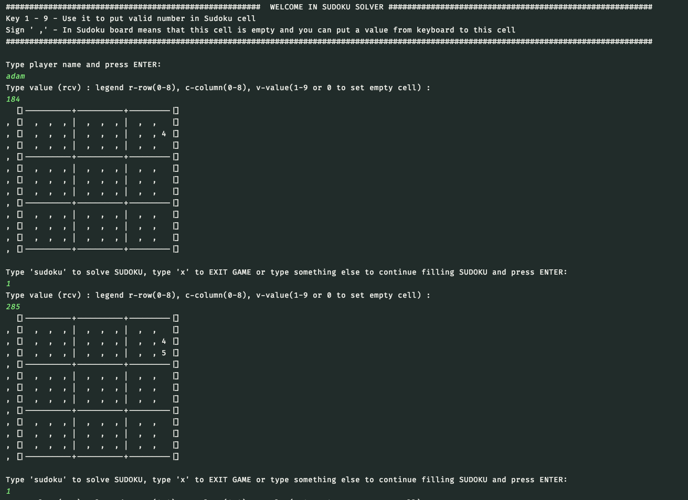
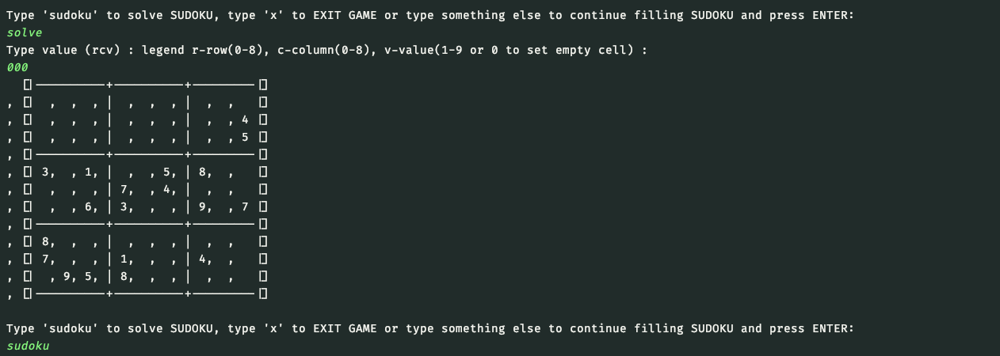
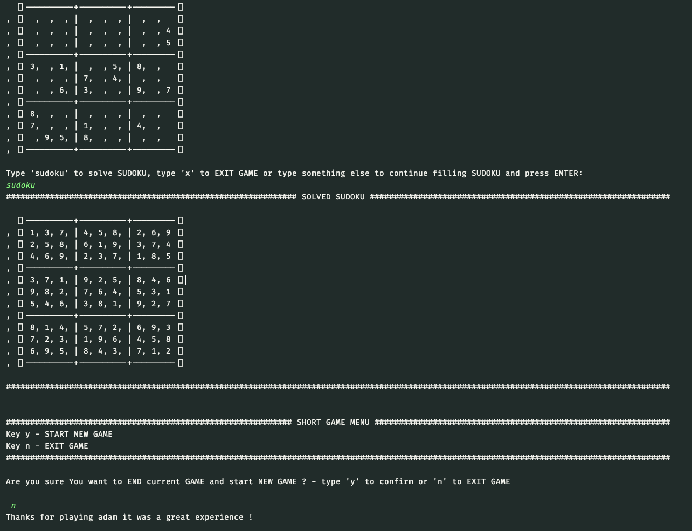

# SUDOKU SOLVER Console Game

## Table of contents

* [Introduction](##Introduction)
* [Gameplay](##Gameplay)
* [Technology](##Technology)

## Introduction

Play with Sudoku Solver for easy sudoku, algorithm use fast iteration solution and for more complicated sudoku,
algorithm will switch to traditional brute-force recursion solver. Whole project was written using TDD methodology.

This project was generated with java jdk-1.8.0_251 LTS version with Gradle

To run application just make few steps:

1. Clone repository to some directory on your computer.
2. First option - Run executable SudokuApplication class from your IDE like Eclipse or InteliJ IDEA.
3. Second option - for Windows system open run.bat file using windows command line.
4. Second option - for UNIX system open run.sh file using terminal (grant proper privileges if needed).

## Gameplay

#### In the game You can:

* Firstly type your player name and after this press ENTER and try to put some values on the board by passing three
  numbers like on screen below.

* After you pass value to board game will always ask you if you want to solve sudoku or continue entering next values or
  you can also exit game by passing 'x'. Game all the time will give you hints what can you do in current step.

* If you make mistake you can always repair it by passing as value '0' (third parameter) then you will clear a filled
  tile or like in picture below wrongly passed 'solve' instead of 'sudoku' just pass '000' to skip filling step and type
  one more time correct word to solve sudoku (correct word is 'sudoku' :P).

* After typing sudoku algorithm will solve sudoku (remember that for brute-force algorithm, depending on sudoku that you
  pass, algorithm can take very long time to solve it but for harder sudoku with solution it should work fast (check
  unit tests) !!!).

## Technology

- Java 8
- JUnit
- Gradle
